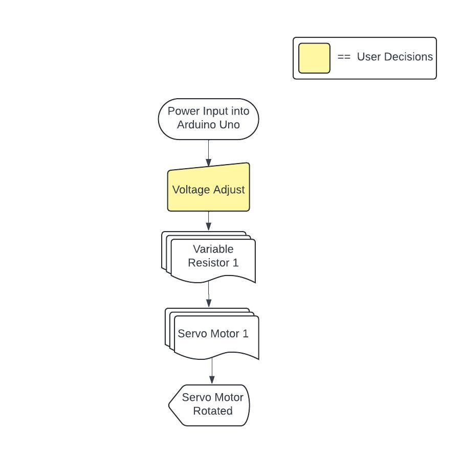

# Robot-Arm

### What is Robot-Arm?
**Robotarm** is mechanical devices designed to mimic and perform tasks similar to the movements of a human arm. They typically consist of multiple segments or links connected by joints, allowing for a wide range of motion.  . Also this project was created in a computer and robotics class as the final project of grade 11, semester 5.
   
**แขนหุ่นยนต์** เป็นอุปกรณ์ทางกลที่ออกแบบมาเพื่อเลียนแบบและทำงานคล้ายกับการเคลื่อนไหวของแขนมนุษย์ โดยทั่วไปแขนหุ่นยนต์ประกอบด้วยส่วนหรือข้อต่อหลายส่วนซึ่งเชื่อมต่อกันด้วยข้อต่อ ซึ่งช่วยให้เคลื่อนไหวได้หลากหลายรูปแบบ นอกจากนี้ โปรเจ็กต์นี้ยังถูกสร้างขึ้นในชั้นเรียนคอมพิวเตอร์และหุ่นยนต์เป็นโปรเจ็กต์สุดท้ายของชั้นมัธยมศึกษาปีที่ 5 ภาคเรียนที่ 2
 
 
 
### Method 
There are 4 Variable Resistors that stick on the box, which are used to control each 4 Servo Motors. There are 2 main parts. The first are joints that are held by 3 Servo Motors normally they just rotate around to adjust the position. The second part is the grabber/hand, for which I used a jumper wire stick to it and tied it with one of the Servo Motor for grabbing something.
 
มี Variable Resistor 4 ตัวที่ติดอยู่บนกล่อง ซึ่งใช้ควบคุม Servo Motor 4 ตัว โดยมี 2 ส่วนหลัก ส่วนแรกคือข้อต่อที่ยึดด้วย Servo Motor 3 ตัว โดยปกติจะหมุนเพื่อปรับตำแหน่ง ส่วนที่สองคือตัวจับ ซึ่งผมใช้สายจัมเปอร์มัดไว้ที่จับและมัดไว้ที่ Servo Motor ตัวหนึ่งเพื่อจับสิ่งของ
 
 
 
### Component List
- Servo Motor 4 pcs
- Variable Resistor 4 pcs
- Plastic Structure 6 pcs 
- Arduino Uno

### Used Language/Tools

  &nbsp;
  &nbsp;
  

### Flowchart

  

   

   

### Demo Video

https://github.com/user-attachments/assets/a89c8bdc-938d-43ce-be13-421c0aae39cd

If you want a longer duration of video or video is unavailable, I have also uploaded a video on YouTube, and the link is provided below. 
[Testing Preview Here](https://youtube.com/shorts/vR_VhIOKlVw)
