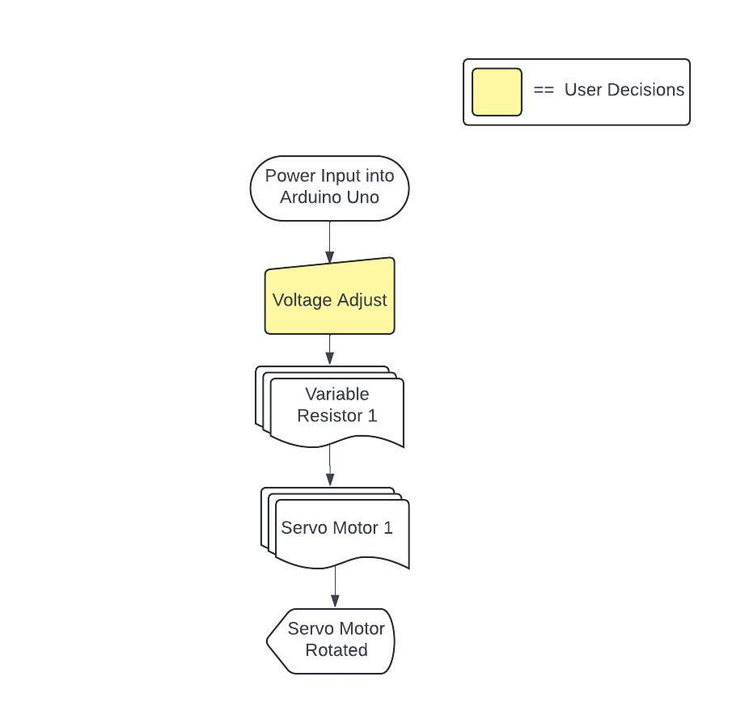

# 🤖 Robot Arm

  
  

## ✨ Overview

Robot Arm is a robotics project developed as the **final project** for my **Grade 11 Computer and Robotics** course.

The objective of the project was to design and build a manually controlled robotic arm capable of moving multiple joints and grasping objects. Inspired by the movement of a human arm, the robot demonstrates fundamental robotics concepts including mechanical design, servo motor control, analog input processing, and Arduino programming.

## ⚙️ How It Works

The robotic arm is controlled using **four variable resistors (potentiometers)** mounted on a custom control box.

Each potentiometer directly controls one servo motor:

* **Three servo motors** control the arm's joints, allowing the arm to rotate and position itself.
* **One servo motor** controls the gripper, enabling it to open and close for picking up objects.

As the user rotates each potentiometer, the Arduino reads the analog input and immediately adjusts the corresponding servo motor, providing intuitive real-time control.

## 🧩 Components

| Component                           | Quantity |
| ----------------------------------- | -------: |
| Servo Motors                        |        4 |
| Variable Resistors (Potentiometers) |        4 |
| Plastic Structural Parts            |        6 |
| Arduino Uno                         |        1 |

## 🖥 Built With

<table>
<tr align="center">
<td width="120">

</td>

<td width="120">

</td>
</tr>

<tr align="center">
<td>Arduino</td>
<td>C</td>
</tr>
</table>

## 🔄 System Flow

## 📸 Development Process

<table>
<tr>
<td align="center">

 <b>Arduino Program</b>
</td>

<td align="center">

 <b>Assembly</b>
</td>

<td align="center">

 <b>Completed Robot Arm</b>
</td>
</tr>
</table>

## 🎥 Demonstration

https://github.com/user-attachments/assets/a89c8bdc-938d-43ce-be13-421c0aae39cd

If the embedded video is unavailable, you can also watch it on YouTube:

https://youtube.com/shorts/vR_VhIOKlVw
